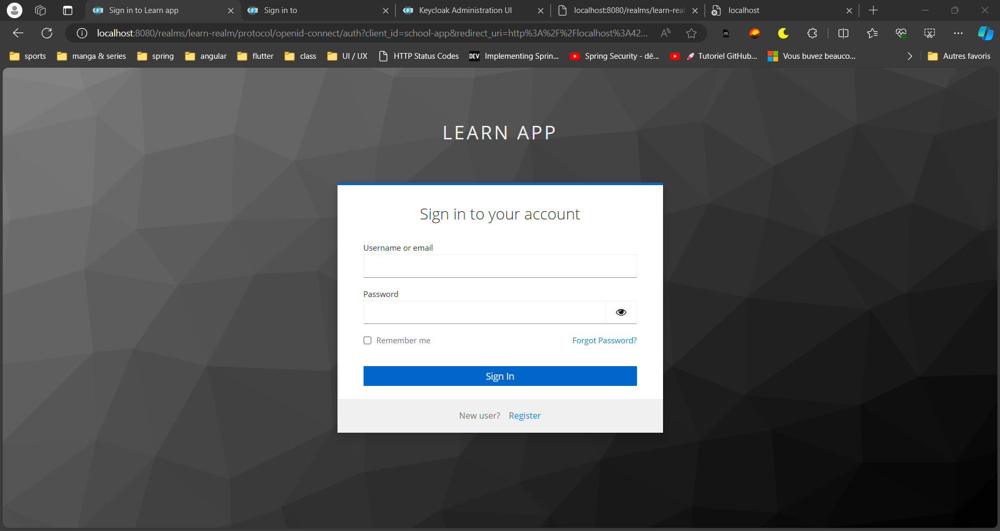

# KEYCLOACK
There are two type of authentication check-sso and login-required
but here in this project we're using check-sso it means that we're not oblige to sign on starting app.
Indeed we can sign when want to acces to some route like schools keycloack give a form in order to sign 
## Login as admin

## Create realm

## Create client

## Create realm role ADMIN & USER

## User created with a password

## Init state user not logged in

## Login Form

## Successfull sign
### Now we can access to the ressources  (School's list)

## School details
